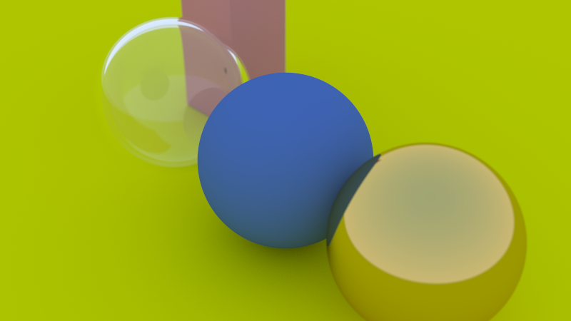

# RayTracingRust

Experimenting with ray tracing algorithms in Rust. This project aims to implement a simple ray tracer using the Rust programming language, exploring efficient rendering techniques and Rust's performance capabilities.

## Features

- **Basic Ray Tracing:** Rendering scenes with rays, materials, and lighting.
- **Image Output:** Generates images in `.ppm` and `.png` formats.
- **Customizable Scenes:** Easily modify scene setup with different objects and lights.

## Installation

1. Clone the repository:
   ```bash
   git clone https://github.com/codetiger/RayTracingRust.git
   cd RayTracingRust
   ```

2.	Build the project:
    ```bash
    cargo build --release 
    ```

3.	Run the project:
    ```bash
    cargo run
    ```

## Usage

Modify the scene parameters in src/main.rs to customize objects, lighting, and camera setup. The output image will be generated in the project directory.

## Dependencies
Rust - Ensure you have the latest version installed.

## Example Output
